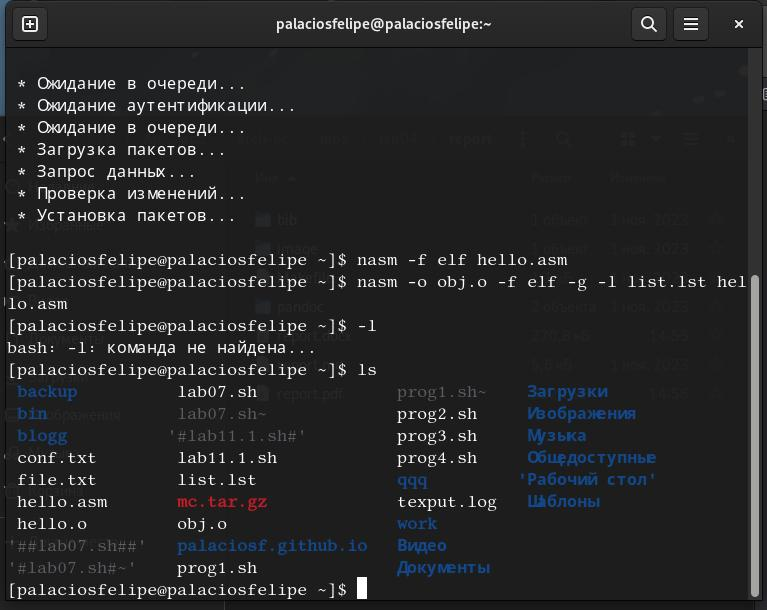
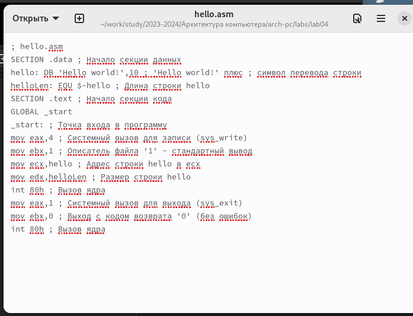
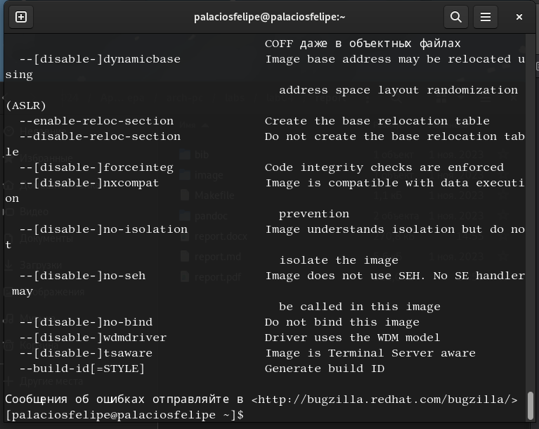
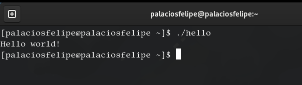
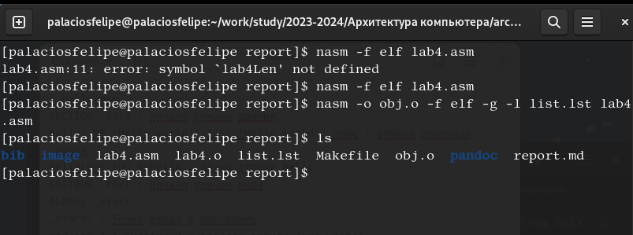
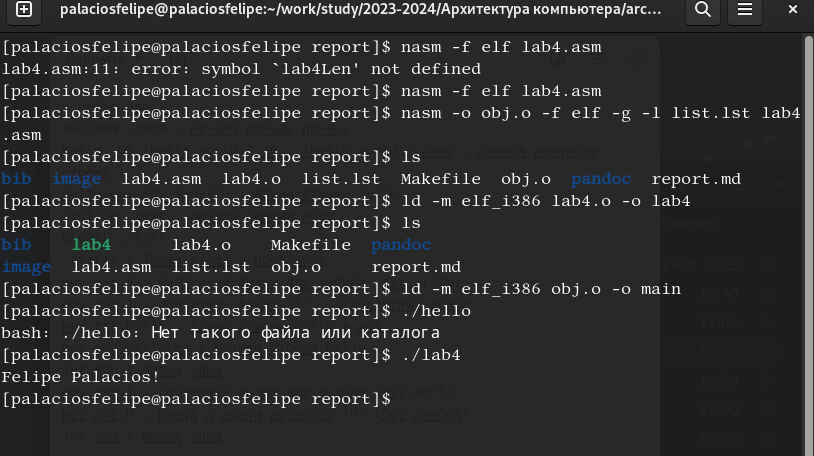
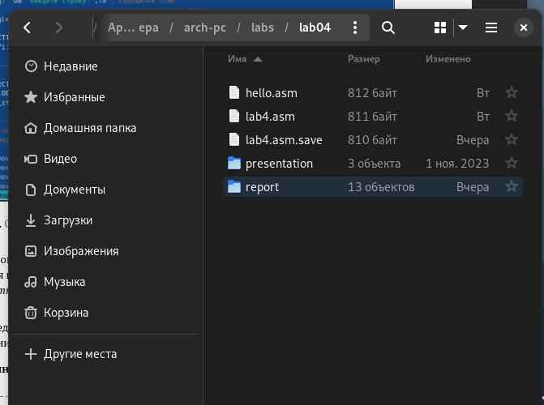
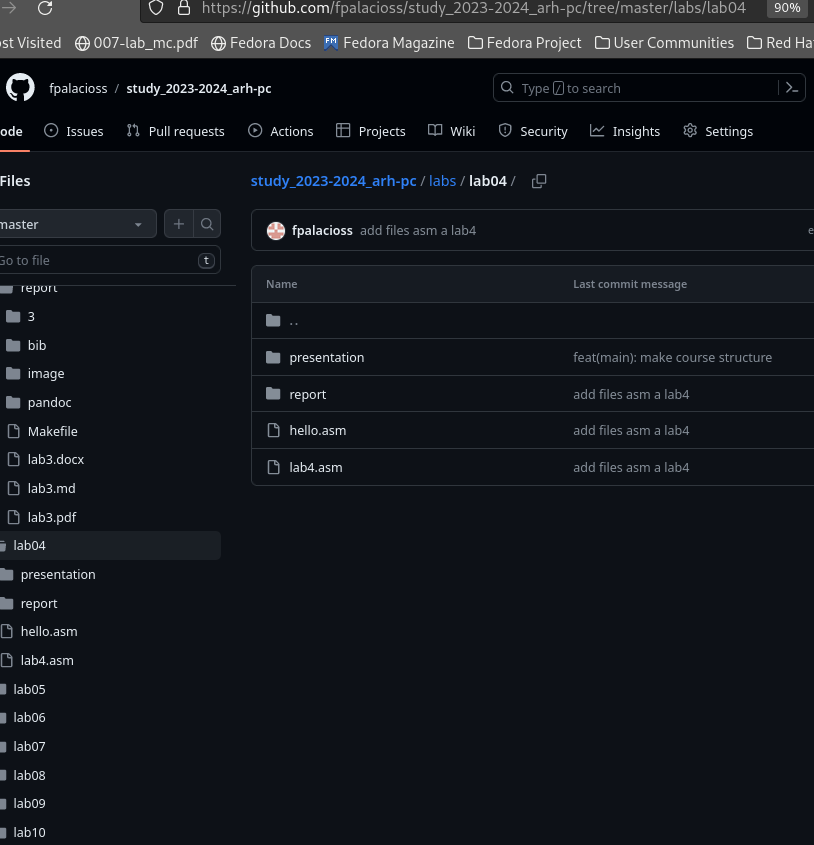

---
## Front matter
title: "Отчет по лабораторной работе №4"
subtitle: "Дисциплина архитектура компьютера"
author: "Паласиос Фелипе"

## Generic otions
lang: ru-RU
toc-title: "Содержание"

## Bibliography
bibliography: bib/cite.bib
csl: pandoc/csl/gost-r-7-0-5-2008-numeric.csl

## Pdf output format
toc: true # Table of contents
toc-depth: 2
lof: true # List of figures
lot: true # List of tables
fontsize: 12pt
linestretch: 1.5
papersize: a4
documentclass: scrreprt
## I18n polyglossia
polyglossia-lang:
  name: russian
  options:
	- spelling=modern
	- babelshorthands=true
polyglossia-otherlangs:
  name: english
## I18n babel
babel-lang: russian
babel-otherlangs: english
## Fonts
mainfont: PT Serif
romanfont: PT Serif
sansfont: PT Sans
monofont: PT Mono
mainfontoptions: Ligatures=TeX
romanfontoptions: Ligatures=TeX
sansfontoptions: Ligatures=TeX,Scale=MatchLowercase
monofontoptions: Scale=MatchLowercase,Scale=0.9
## Biblatex
biblatex: true
biblio-style: "gost-numeric"
biblatexoptions:
  - parentracker=true
  - backend=biber
  - hyperref=auto
  - language=auto
  - autolang=other*
  - citestyle=gost-numeric
## Pandoc-crossref LaTeX customization
figureTitle: "Рис."
tableTitle: "Таблица"
listingTitle: "Листинг"
lofTitle: "Список иллюстраций"
lotTitle: "Список таблиц"
lolTitle: "Листинги"
## Misc options
indent: true
header-includes:
  - \usepackage{indentfirst}
  - \usepackage{float} # keep figures where there are in the text
  - \floatplacement{figure}{H} # keep figures where there are in the text
---

# Цель работы

Целью работы является освоение процедуры оформления отчетов с помощью легковесного
языка разметки Markdown.

# Задание

Порядок выполнения лабораторной работы

 Программа Hello world!

1. Рассмотрим пример простой программы на языке ассемблера NASM. Традиционно первая
   программа выводит приветственное сообщение Hello world! на экран.
   Создайте каталог для работы с программами на языке ассемблера NASM:

   mkdir -p ~/work/arch-pc/lab04

2. Перейдите в созданный каталог

   cd ~/work/arch-pc/lab04

3. Создайте текстовый файл с именем hello.asm

   touch hello.asm

4. откройте этот файл с помощью любого текстового редактора, например, gedit
gedit hello.asm и введите в него следующий текст:

5. Транслятор NASM
   для компиляции приве-
   дённого выше текста программы «Hello World» необходимо написать:
   nasm -f elf hello.asm
   Если текст программы набран без ошибок, то транслятор преобразует текст программы
   из файла hello.asm в объектный код, который запишется в файл hello.o. Таким образом,

6. Расширенный синтаксис командной строки NASM
   Полный вариант командной строки nasm выглядит следующим образом: nasm 
   [-@ косвенный_файл_настроек] [-o объектный_файл] [-f
   формат_объектного_файла] [-l листинг] [параметры...] [--] исходный_файл↪
   Выполните следующую команду:
   nasm -o obj.o -f elf -g -l list.lst hello.asm
   Данная команда скомпилирует исходный файл hello.asm в obj.o (опция -o позволяет
   задать имя объектного файла, в данном случае obj.o), при этом формат выходного файла
   будет elf, и в него будут включены символы для отладки (опция -g), кроме того, будет создан
   файл листинга list.lst (опция -l).
   С помощью команды ls проверьте, что файлы были созданы.

7. Компоновщик LD
   чтобы получить исполняемую программу, объектный файл
   необходимо передать на обработку компоновщику:
   ld -m elf_i386 hello.o -o hello

   С помощью команды ls проверьте, что исполняемый файл hello был создан.
   Компоновщик ld не предполагает по умолчанию расширений для файлов, но принято
   использовать следующие расширения:
   • o – для объектных файлов;
   • без расширения – для исполняемых файлов;
   • map – для файлов схемы программы;
   • lib – для библиотек.
     Ключ -o с последующим значением задаёт в данном случае имя создаваемого исполняе-
     мого файла.
     Выполните следующую команду:

   ld -m elf_i386 obj.o -o main
   
  Формат командной строки LD можно увидеть, набрав ld --help. 

8. Запуск исполняемого файла
   Запустить на выполнение созданный исполняемый файл, находящийся в текущем каталоге,
   можно, набрав в командной строке:
   ./hello

9.  Задание для самостоятельной работы

10. В каталоге ~/work/arch-pc/lab04 с помощью команды cp создайте копию файла

   hello.asm с именем lab4.asm

11. С помощью любого текстового редактора внесите изменения в текст программы в
    файле lab4.asm так, чтобы вместо Hello world! на экран выводилась строка с вашими
    фамилией и именем.

12. Оттранслируйте полученный текст программы lab4.asm в объектный файл. Выполните
    компоновку объектного файла и запустите получившийся исполняемый файл.
13. Скопируйте файлы hello.asm и lab4.asm в Ваш локальный репозиторий в ката-
    лог ~/work/study/2023-2024/"Архитектура компьютера"/arch-pc/labs/lab04/.
    Загрузите файлы на Github.

# Выполнение лабораторной работы

Порядок выполнения лабораторной работы

 Программа Hello world!

1. Создайте каталог для работы с программами на языке ассемблера NASM:

   mkdir -p ~/work/arch-pc/lab04
 
2. Перейдите в созданный каталог

   cd ~/work/arch-pc/lab04

3. Создайте текстовый файл с именем hello.asm (рис. @fig:001).

  {#fig:001 width=70%}

   touch hello.asm

4. откройте этот файл с помощью любого текстового редактора, например, gedit (рис. @fig:002).

  gedit hello.asm
  
  {#fig:002 width=70%}

  и введите в него следующий текст:

5. Транслятор NASM для компиляции приведённого выше текста программы «Hello World» необходимо написать:
   nasm -f elf hello.asm Если текст программы набран без ошибок, то транслятор преобразует текст программы
   из файла hello.asm в объектный код, который запишется в файл hello.o. Таким образом, (рис. @fig:003).
   
    {#fig:003 width=70%}

6. Расширенный синтаксис командной строки NASM
   
   Выполните следующую команду:
   nasm -o obj.o -f elf -g -l list.lst hello.asm
   Данная команда скомпилирует исходный файл hello.asm в obj.o (опция -o позволяет задать имя объектного файла, в данном случае obj.o), при этом формат выходного файла
   будет elf, и в него будут включены символы для отладки (опция -g), кроме того, будет создан
   файл листинга list.lst (опция -l).
   С помощью команды ls проверьте, что файлы были созданы.  (рис. @fig:004).
   
   {#fig:004 width=70%}

7. Компоновщик LD
   чтобы получить исполняемую программу, объектный файл
   необходимо передать на обработку компоновщику:
   ld -m elf_i386 hello.o -o hello  
       
    С помощью команды ls проверьте, что исполняемый файл hello был создан.
       Выполните следующую команду:

   ld -m elf_i386 obj.o -o main
   
  Формат командной строки LD можно увидеть, набрав ld --help (рис. @fig:005)
  
 {#fig:005 width=70%}
 
8. Запуск исполняемого файла
   Запустить на выполнение созданный исполняемый файл, находящийся в текущем каталоге,
   можно, набрав в командной строке (рис. @fig:006)
   ./hello
{#fig:006 width=70%}

9.  Задание для самостоятельной работы

10. В каталоге ~/work/arch-pc/lab04 с помощью команды cp создайте копию файла (рис. @fig:007)

   hello.asm с именем lab4.asm
   
{#fig:007 width=70%}

11. С помощью любого текстового редактора внесите изменения в текст программы в файле lab4.asm так, чтобы вместо Hello world! на экран выводилась строка с вашими
    фамилией и именем

12. Оттранслируйте полученный текст программы lab4.asm в объектный файл. Выполните компоновку объектного файла и запустите получившийся исполняемый файл (рис. @fig:008)

{#fig:008 width=70%}

13. Скопируйте файлы hello.asm и lab4.asm в Ваш локальный репозиторий в каталог ~/work/study/2023-2024/"Архитектура компьютера"/arch-pc/labs/lab04/ (рис. @fig:09)
    Загрузите файлы на Github (рис. @fig:010)
    
{#fig:009 width=70%}

{#fig:010 width=70%}

# Выводы

Были освоены процедуры компиляции и сборки программ, написанных на ассемблере NASM

# Список литературы{.unnumbered}

::: {#refs}
:::
