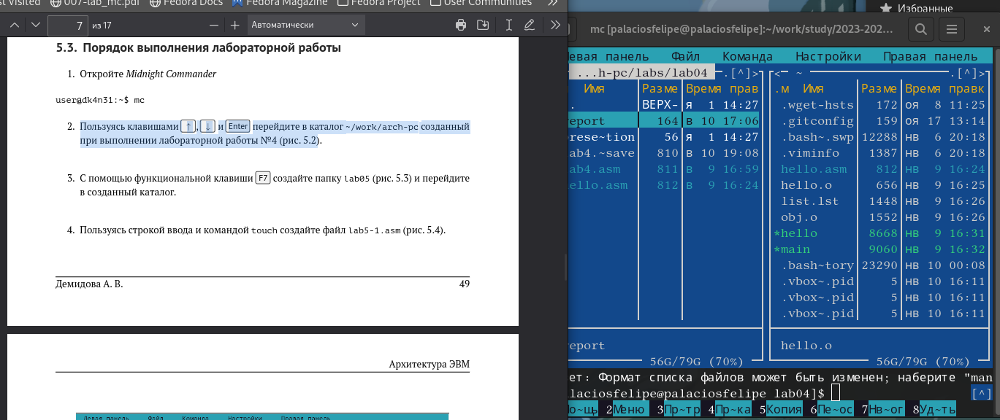
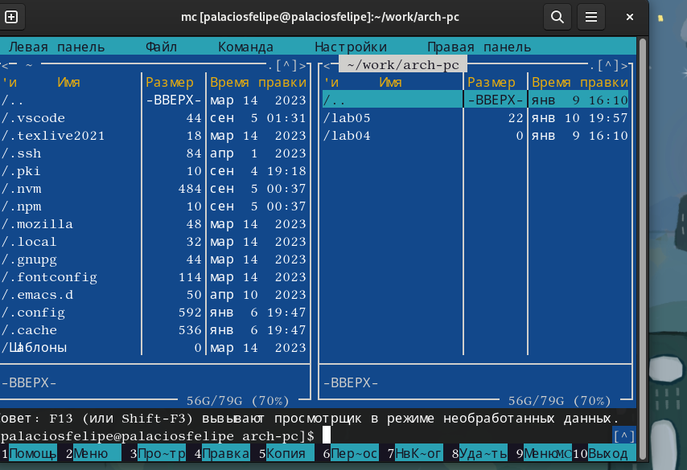
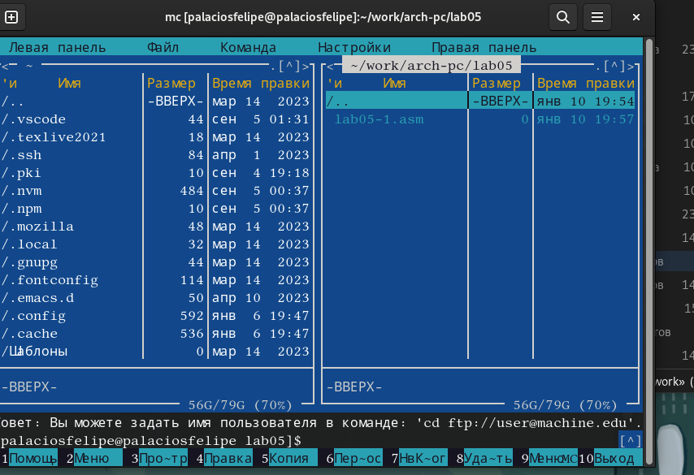
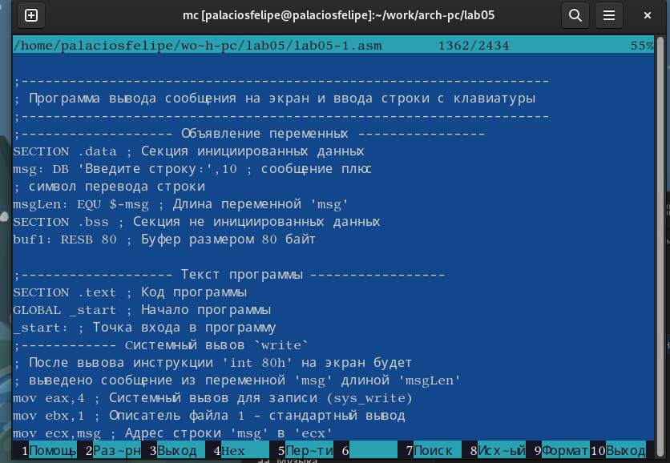
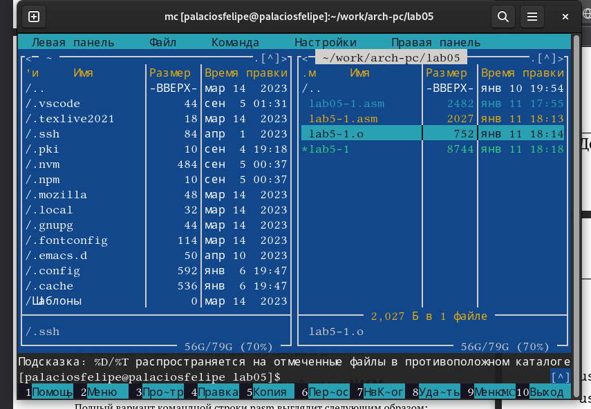
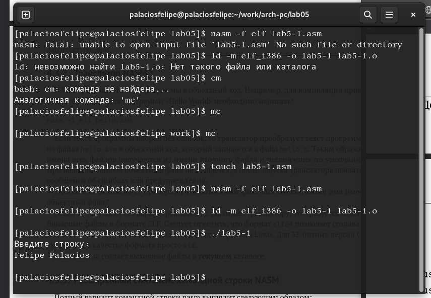
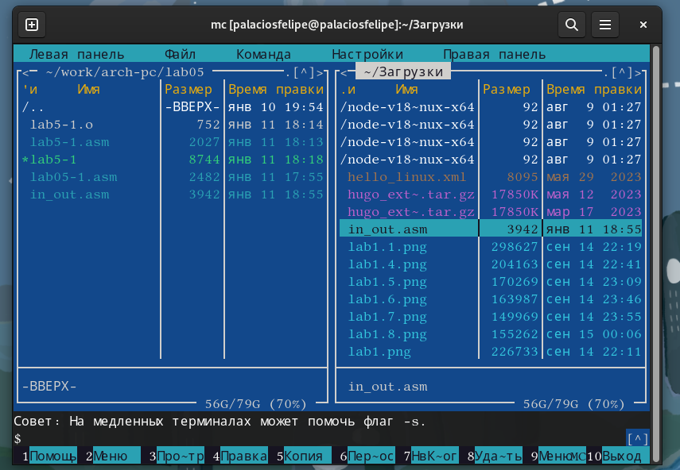
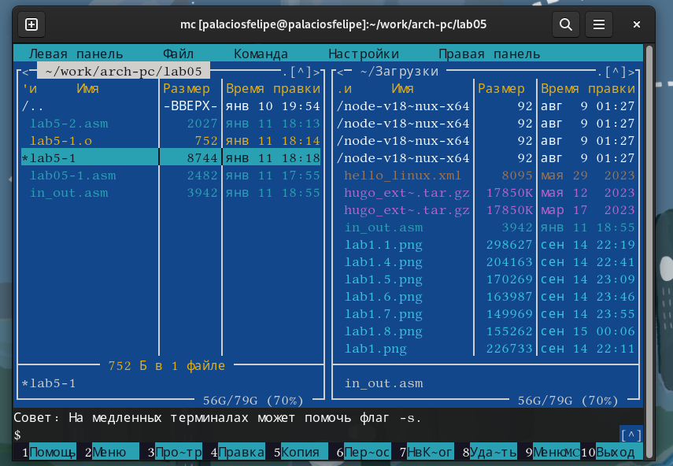
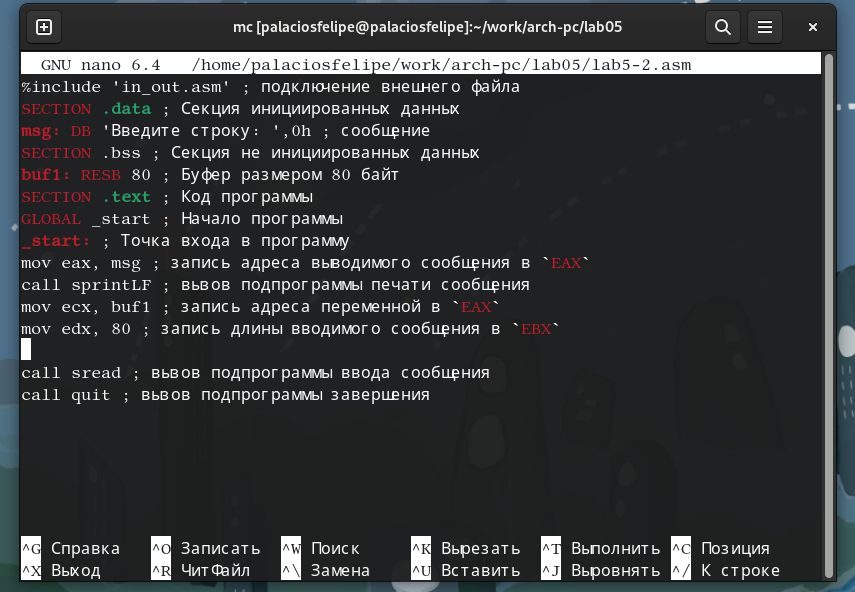
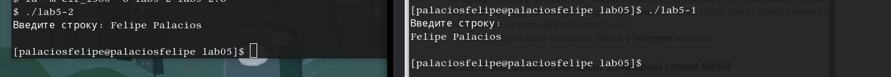

---
## Front matter
title: "Отчет по лабораторной работе №5"
subtitle: "Основы работы с Midnight Commander"
author: "Паласиос Фелипе"

## Generic otions
lang: ru-RU
toc-title: "Содержание"

## Bibliography
bibliography: bib/cite.bib
csl: pandoc/csl/gost-r-7-0-5-2008-numeric.csl

## Pdf output format
toc: true # Table of contents
toc-depth: 2
lof: true # List of figures
lot: true # List of tables
fontsize: 12pt
linestretch: 1.5
papersize: a4
documentclass: scrreprt
## I18n polyglossia
polyglossia-lang:
  name: russian
  options:
	- spelling=modern
	- babelshorthands=true
polyglossia-otherlangs:
  name: english
## I18n babel
babel-lang: russian
babel-otherlangs: english
## Fonts
mainfont: PT Serif
romanfont: PT Serif
sansfont: PT Sans
monofont: PT Mono
mainfontoptions: Ligatures=TeX
romanfontoptions: Ligatures=TeX
sansfontoptions: Ligatures=TeX,Scale=MatchLowercase
monofontoptions: Scale=MatchLowercase,Scale=0.9
## Biblatex
biblatex: true
biblio-style: "gost-numeric"
biblatexoptions:
  - parentracker=true
  - backend=biber
  - hyperref=auto
  - language=auto
  - autolang=other*
  - citestyle=gost-numeric
## Pandoc-crossref LaTeX customization
figureTitle: "Рис."
tableTitle: "Таблица"
listingTitle: "Листинг"
lofTitle: "Список иллюстраций"
lotTitle: "Список таблиц"
lolTitle: "Листинги"
## Misc options
indent: true
header-includes:
  - \usepackage{indentfirst}
  - \usepackage{float} # keep figures where there are in the text
  - \floatplacement{figure}{H} # keep figures where there are in the text
---

# Цель работы

Приобретение практических навыков работы в Midnight Commander. Освоение инструкций языка ассемблера mov и int

# Задание

1. Откройте Midnight Commander user@dk4n31:~$ mc

2. Пользуясь клавишами ↑ , ↓ и Enter перейдите в каталог ~/work/arch-pc созданный при выполнении лабораторной работы No4 

3. С помощью функциональной клавиши F7 создайте папку lab05 и перейдите
в созданный каталог.

4. Пользуясь строкой ввода и командой touch создайте файл lab5-1.asm 

5. С помощью функциональной клавиши F4 откройте файл lab5-1.asm для редактирова-
ния во встроенном редакторе. Как правило в качестве встроенного редактора Midnight Commander используется редакторы nano или mcedit

6. Введите текст программы из листинга 5.1 (можно без комментариев), сохраните изменения и закройте файл

7. С помощью функциональной клавиши F3 откройте файл lab5-1.asm для просмотра.
Убедитесь, что файл содержит текст программы.

8. Оттранслируйте текст программы lab5-1.asm в объектный файл. Выполните компо-
новку объектного файла и запустите получившийся исполняемый файл. Программа
выводит строку 'Введите строку:' и ожидает ввода с клавиатуры. На запрос введите
Ваши ФИО.

9. Скачайте файл in_out.asm со страницы курса в ТУИС.

10. Подключаемый файл in_out.asm должен лежать в том же каталоге, что и файл с программой, в которой он используется

В одной из панелей mc откройте каталог с файлом lab5-1.asm. В другой панели каталогсо скаченным файлом in_out.asm (для перемещения между панелями используйте Tab ). Скопируйте файл in_out.asm в каталог с файлом lab5-1.asm с помощью функциональной клавиши F5 
  
11. С помощью функциональной клавиши F6 создайте копию файла lab5-1.asm с именем
lab5-2.asm. Выделите файл lab5-1.asm, нажмите клавишу F6 , введите имя файла
lab5-2.asm и нажмите клавишу Enter

12. Исправьте текст программы в файле lab5-2.asm с использование подпрограмм из
внешнего файла in_out.asm (используйте подпрограммы sprintLF, sread и quit) в
соответствии с листингом 5.2. Создайте исполняемый файл и проверьте его работу.

13. В файле lab5-2.asm замените подпрограмму sprintLF на sprint. Создайте исполняемый файл и проверьте его работу. 

# Выполнение лабораторной работы

1. Откройте Midnight Commander user@dk4n31:~$ mc

2. Пользуясь клавишами ↑ , ↓ и Enter перейдите в каталог ~/work/arch-pc созданный при выполнении лабораторной работы No4 (рис. @fig:001).

{#fig:001 width=70%}

3. С помощью функциональной клавиши F7 создайте папку lab05 и перейдите
в созданный каталог. (рис. @fig:002).

{#fig:002 width=70%}

4. Пользуясь строкой ввода и командой touch создайте файл lab5-1.asm (рис. @fig:003).

{#fig:003 width=70%}

5. С помощью функциональной клавиши F4 откройте файл lab5-1.asm для редактирова-
ния во встроенном редакторе. Как правило в качестве встроенного редактора Midnight Commander используется редакторы nano или mcedit 

6. Введите текст программы из листинга 5.1 (можно без комментариев), сохраните изменения и закройте файл (рис. @fig:004).

{#fig:004 width=70%}

7. С помощью функциональной клавиши F3 откройте файл lab5-1.asm для просмотра.
Убедитесь, что файл содержит текст программы (рис. @fig:005).

{#fig:005 width=70%}

8. Оттранслируйте текст программы lab5-1.asm в объектный файл. Выполните компо-
новку объектного файла и запустите получившийся исполняемый файл. Программа
выводит строку 'Введите строку:' и ожидает ввода с клавиатуры. На запрос введите
Ваши ФИО (рис. @fig:006) (рис. @fig:007)

{#fig:006 width=70%}

{#fig:007 width=70%}

9. Скачайте файл in_out.asm со страницы курса в ТУИС (рис. @fig:008)

{#fig:008 width=70%}

10. Подключаемый файл in_out.asm должен лежать в том же каталоге, что и файл с программой, в которой он используется 
В одной из панелей mc откройте каталог с файлом lab5-1.asm. В другой панели каталогсо скаченным файлом in_out.asm (для перемещения между панелями используйте Tab ). Скопируйте файл in_out.asm в каталог с файлом lab5-1.asm с помощью функциональной клавиши F5 (рис. @fig:009)

{#fig:009 width=70%}
  
11. С помощью функциональной клавиши F6 создайте копию файла lab5-1.asm с именем
lab5-2.asm. Выделите файл lab5-1.asm, нажмите клавишу F6 , введите имя файла
lab5-2.asm и нажмите клавишу Enter (рис. @fig:010)

{#fig:010 width=70%}

12. Исправьте текст программы в файле lab5-2.asm с использование подпрограмм из
внешнего файла in_out.asm (используйте подпрограммы sprintLF, sread и quit) в
соответствии с листингом 5.2. Создайте исполняемый файл и проверьте его работу (рис. @fig:011).
 
{#fig:011 width=70%}
 
13. В файле lab5-2.asm замените подпрограмму sprintLF на sprint. Создайте исполняемый файл и проверьте его работу (рис. @fig:012).

{#fig:012 width=70%}

# Выводы

Были приобретены практических навыков работы в Midnight Commander. Освоены инструкций языка ассемблера mov и int

# Список литературы{.unnumbered}

::: {#refs}
:::
