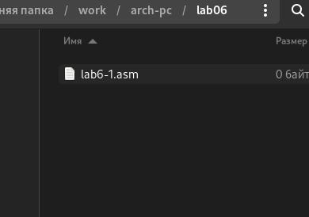
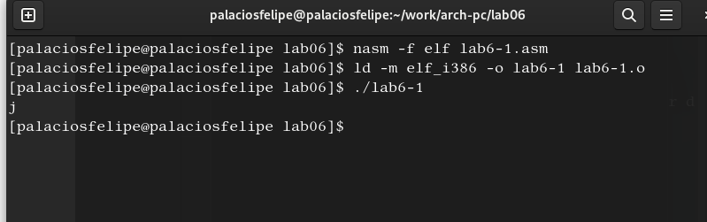
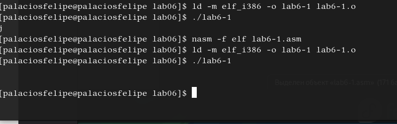
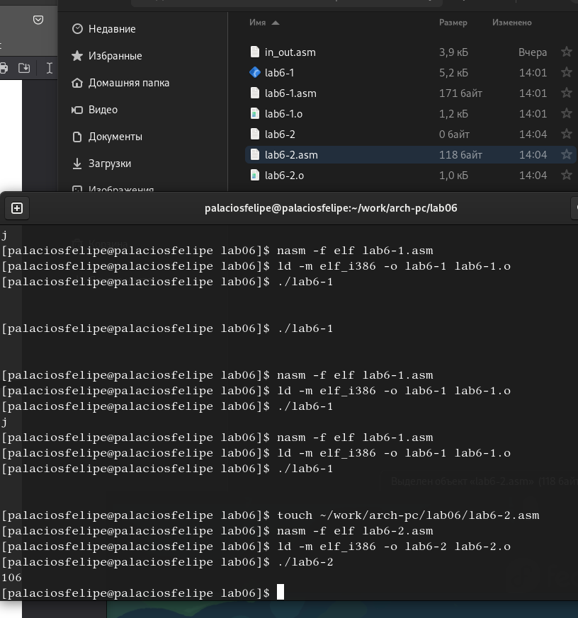
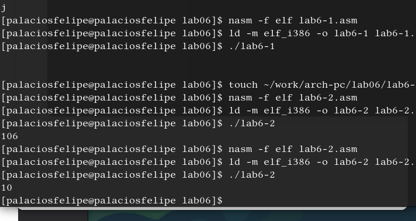
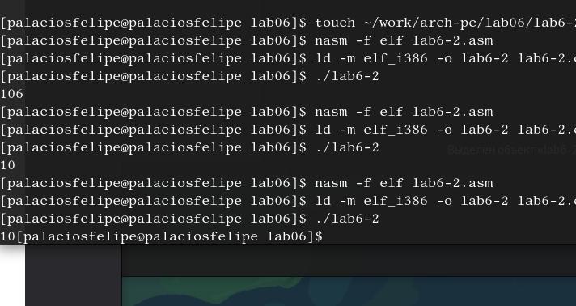
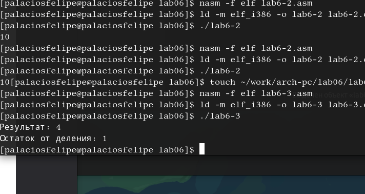
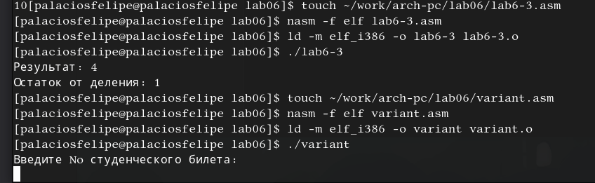
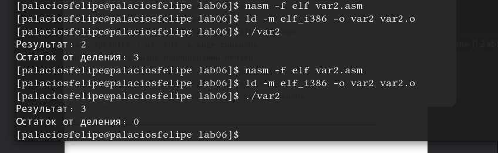
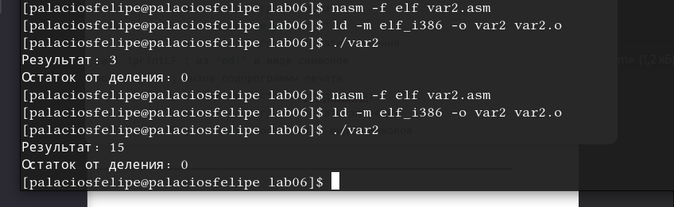

---
## Front matter
title: "Отчет по лабораторной работе №6"
subtitle: "Арифметические операции в NASM"
author: "Паласиос Фелипе"

## Generic otions
lang: ru-RU
toc-title: "Содержание"

## Bibliography
bibliography: bib/cite.bib
csl: pandoc/csl/gost-r-7-0-5-2008-numeric.csl

## Pdf output format
toc: true # Table of contents
toc-depth: 2
lof: true # List of figures
lot: true # List of tables
fontsize: 12pt
linestretch: 1.5
papersize: a4
documentclass: scrreprt
## I18n polyglossia
polyglossia-lang:
  name: russian
  options:
	- spelling=modern
	- babelshorthands=true
polyglossia-otherlangs:
  name: english
## I18n babel
babel-lang: russian
babel-otherlangs: english
## Fonts
mainfont: PT Serif
romanfont: PT Serif
sansfont: PT Sans
monofont: PT Mono
mainfontoptions: Ligatures=TeX
romanfontoptions: Ligatures=TeX
sansfontoptions: Ligatures=TeX,Scale=MatchLowercase
monofontoptions: Scale=MatchLowercase,Scale=0.9
## Biblatex
biblatex: true
biblio-style: "gost-numeric"
biblatexoptions:
  - parentracker=true
  - backend=biber
  - hyperref=auto
  - language=auto
  - autolang=other*
  - citestyle=gost-numeric
## Pandoc-crossref LaTeX customization
figureTitle: "Рис."
tableTitle: "Таблица"
listingTitle: "Листинг"
lofTitle: "Список иллюстраций"
lotTitle: "Список таблиц"
lolTitle: "Листинги"
## Misc options
indent: true
header-includes:
  - \usepackage{indentfirst}
  - \usepackage{float} # keep figures where there are in the text
  - \floatplacement{figure}{H} # keep figures where there are in the text
---

# Цель работы

Освоение арифметических инструкций языка ассемблера NASM.

# Задание

1. Создайте каталог для программам лабораторной работы No 6, перейдите в него и создайте файл lab6-1.asm

2. Введите в файл lab6-1.asm текст программы из листинга 6.1. Создайте исполняемый файл и запустите его.
3. Далее изменим текст программы и вместо символов, запишем в регистры числа. Исправьте текст программы (Листинг 6.1) Создайте исполняемый файл и запустите его.
4. Создайте файл lab6-2.asm в каталоге ~/work/arch-pc/lab06 и введите в него текст программы из листинга 6.2
Создайте исполняемый файл и запустите его
5. 1.Аналогично предыдущему примеру изменим символы на числа. Замените строки 
Создайте исполняемый файл и запустите его. 

2.Замените функцию iprintLF на iprint. Создайте исполняемый файл и запустите его. Чем отличается вывод функций iprintLF и iprint?

6. В качестве примера выполнения арифметических операций в NASM приведем про-
грамму вычисления арифметического выражения 𝑓(𝑥) = (5 ∗ 2 + 3)/3.
Создайте файл lab6-3.asm в каталоге ~/work/arch-pc/lab06:
Создайте исполняемый файл и запустите его. 
7. Создайте файл variant.asm в каталоге ~/work/arch-pc/lab06 Вычисления варианта задания по номеру студенческого билета.Создайте исполняемый файл и запустите его. Проверьте результат работы программы
вычислив номер варианта аналитически.

8. Написать программу вычисления выражения 𝑦 = 𝑓(𝑥). Программа должна выводить
выражение для вычисления, выводить запрос на ввод значения 𝑥, вычислять задан-
ное выражение в зависимости от введенного 𝑥, выводить результат вычислений. Вид
функции 𝑓(𝑥) выбрать из таблицы 6.3 вариантов заданий в соответствии с номером
полученным при выполнении лабораторной работы. Создайте исполняемый файл и
проверьте его работу для значений 𝑥1 и 𝑥2 из 6.3

# Выполнение лабораторной работы

1. Создайте каталог для программам лабораторной работы No 6, перейдите в него и создайте файл lab6-1.asm (рис. @fig:001).

{#fig:001 width=70%}

2. Введите в файл lab6-1.asm текст программы из листинга 6.1. Создайте исполняемый файл и запустите его (рис. @fig:002)

{#fig:002 width=70%}

3. Далее изменим текст программы и вместо символов, запишем в регистры числа. Исправьте текст программы (Листинг 6.1) Создайте исполняемый файл и запустите его (рис. @fig:003).

{#fig:003 width=70%}

4. Создайте файл lab6-2.asm в каталоге ~/work/arch-pc/lab06 и введите в него текст программы из листинга 6.2 Создайте исполняемый файл и запустите его (рис. @fig:004).

{#fig:004 width=70%}

5. 1.Аналогично предыдущему примеру изменим символы на числа. Замените строки 
Создайте исполняемый файл и запустите его (рис. @fig:005).

{#fig:005 width=70%}

2.Замените функцию iprintLF на iprint. Создайте исполняемый файл и запустите его. Чем отличается вывод функций iprintLF и iprint? (рис. @fig:006).

{#fig:006 width=70%}

6. В качестве примера выполнения арифметических операций в NASM приведем про-
грамму вычисления арифметического выражения 𝑓(𝑥) = (5 ∗ 2 + 3)/3.
Создайте файл lab6-3.asm в каталоге ~/work/arch-pc/lab06:
Создайте исполняемый файл и запустите его (рис. @fig:007).

{#fig:007 width=70%}

7. Создайте файл variant.asm в каталоге ~/work/arch-pc/lab06 Вычисления варианта задания по номеру студенческого билета.Создайте исполняемый файл и запустите его. Проверьте результат работы программы
вычислив номер варианта аналитически (рис. @fig:008).

{#fig:008 width=70%}

8. Написать программу вычисления выражения 𝑦 = 𝑓(𝑥). Программа должна выводить
выражение для вычисления, выводить запрос на ввод значения 𝑥, вычислять задан-
ное выражение в зависимости от введенного 𝑥, выводить результат вычислений. Вид
функции 𝑓(𝑥) выбрать из таблицы 6.3 вариантов заданий в соответствии с номером
полученным при выполнении лабораторной работы. Создайте исполняемый файл и
проверьте его работу для значений 𝑥1 и 𝑥2 из 6.3 (рис. @fig:009) (рис. @fig:010)

{#fig:009 width=70%}

{#fig:010 width=70%}

# Выводы

Освоены арифметических инструкций языка ассемблера NASM.

# Список литературы{.unnumbered}

::: {#refs}
:::
