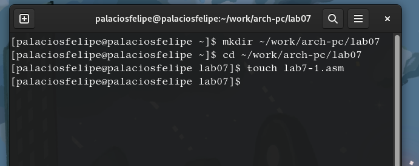
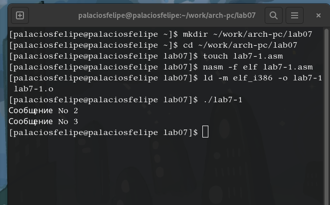
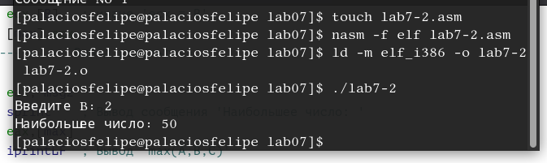
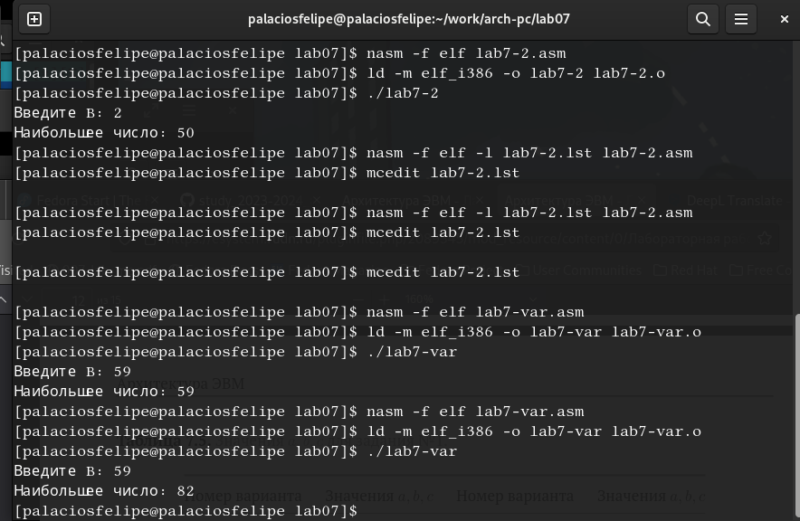

---
## Front matter
title: "ПОтчет по лабораторной работе №8"
subtitle: "Программирование цикла. Обработка аргументов командной строки"
author: "Паласиос Фелипе"

## Generic otions
lang: ru-RU
toc-title: "Содержание"

## Bibliography
bibliography: bib/cite.bib
csl: pandoc/csl/gost-r-7-0-5-2008-numeric.csl

## Pdf output format
toc: true # Table of contents
toc-depth: 2
lof: true # List of figures
lot: true # List of tables
fontsize: 12pt
linestretch: 1.5
papersize: a4
documentclass: scrreprt
## I18n polyglossia
polyglossia-lang:
  name: russian
  options:
	- spelling=modern
	- babelshorthands=true
polyglossia-otherlangs:
  name: english
## I18n babel
babel-lang: russian
babel-otherlangs: english
## Fonts
mainfont: PT Serif
romanfont: PT Serif
sansfont: PT Sans
monofont: PT Mono
mainfontoptions: Ligatures=TeX
romanfontoptions: Ligatures=TeX
sansfontoptions: Ligatures=TeX,Scale=MatchLowercase
monofontoptions: Scale=MatchLowercase,Scale=0.9
## Biblatex
biblatex: true
biblio-style: "gost-numeric"
biblatexoptions:
  - parentracker=true
  - backend=biber
  - hyperref=auto
  - language=auto
  - autolang=other*
  - citestyle=gost-numeric
## Pandoc-crossref LaTeX customization
figureTitle: "Рис."
tableTitle: "Таблица"
listingTitle: "Листинг"
lofTitle: "Список иллюстраций"
lotTitle: "Список таблиц"
lolTitle: "Листинги"
## Misc options
indent: true
header-includes:
  - \usepackage{indentfirst}
  - \usepackage{float} # keep figures where there are in the text
  - \floatplacement{figure}{H} # keep figures where there are in the text
---

# Цель работы

Приобретение навыков написания программ с использованием циклов и обработкой
аргументов командной строки.

# Задание

1. Создайте каталог для программам лабораторной работы No 8, перейдите в него и создайте
файл lab8-1.asm:

2.При реализации циклов в NASM с использованием инструкции loop необходимо помнить
о том, что эта инструкция использует регистр ecx в качестве счетчика и на каждом шаге
уменьшает его значение на единицу. В качестве примера рассмотрим программу, которая
выводит значение регистра ecx. Внимательно изучите текст программы (Листинг 8.1).
Листинг 8.1. Программа вывода значений регистра ecx

%include 'in_out.asm'
SECTION .data
msg1 db 'Введите N: ',0h

3. Введите в файл lab8-1.asm текст программы из листинга 8.1. Создайте исполняемый файл
и проверьте его работу.
Данный пример показывает, что использование регистра ecx в теле цилка loop может
привести к некорректной работе программы. Измените текст программы добавив изменение
значение регистра ecx в цикле:

label:
sub ecx,1 ; `ecx=ecx-1`
mov [N],ecx
mov eax,[N]
call iprintLF

4. Создайте исполняемый файл и проверьте его работу. Какие значения принимает регистр
ecx в цикле? Соответствует ли число проходов цикла значению 𝑁 введенному с клавиатуры?
Для использования регистра ecx в цикле и сохранения корректности работы программы
можно использовать стек. Внесите изменения в текст программы добавив команды push
и pop (добавления в стек и извлечения из стека) для сохранения значения счетчика цикла
loop:

5. Создайте исполняемый файл и проверьте его работу. Соответствует ли в данном случае
число проходов цикла значению 𝑁 введенному с клавиатуры?

6. .3.2. Обработка аргументов командной строки
При разработке программ иногда встает необходимость указывать аргументы, которые
будут использоваться в программе, непосредственно из командной строки при запуске
программы.
При запуске программы в NASM аргументы командной строки загружаются в стек в обрат-
ном порядке, кроме того в стек записывается имя программы и общее количество аргументов.
Последние два элемента стека для программы, скомпилированной NASM, – это всегда имя
программы и количество переданных аргументов.
Таким образом, для того чтобы использовать аргументы в программе, их просто нужно
извлечь из стека. Обработку аргументов нужно проводить в цикле. Т.е. сначала нужно из-
влечь из стека количество аргументов, а затем циклично для каждого аргумента выполнить
логику программы. В качестве примера рассмотрим программу, которая выводит на экран
аргументы командной строки. Внимательно изучите текст программы (Листинг 8.2).
Листинг 8.2. Программа выводящая на экран аргументы командной строки

7. Создайте файл lab8-2.asm в каталоге ~/work/arch-pc/lab08 и введите в него текст про-
граммы из листинга 8.2.
Создайте исполняемый файл и запустите его, указав аргументы:

8. Сколько аргументов было обработано программой?
Рассмотрим еще один пример программы которая выводит сумму чисел, которые пере-
даются в программу как аргументы. Создайте файл lab8-3.asm в каталоге ~/work/arch-
pc/lab08 и введите в него текст программы из листинга 8.3.
Листинг 8.3. Программа вычисления суммы аргументов командной строки

9. Создайте исполняемый файл и запустите его, указав аргументы. Пример результата работы
программы

10. Измените текст программы из листинга 8.3 для вычисления произведения аргументов
командной строки

. Задание для самостоятельной работы

11. 1. Напишите программу, которая находит сумму значений функции 𝑓(𝑥) для
𝑥 = 𝑥1, 𝑥2, ..., 𝑥𝑛, т.е. программа должна выводить значение 𝑓(𝑥1) + 𝑓(𝑥2) + ... + 𝑓(𝑥𝑛).
Значения 𝑥𝑖 передаются как аргументы. Вид функции 𝑓(𝑥) выбрать из таблицы
8.1 вариантов заданий в соответствии с вариантом, полученным при выполнении
лабораторной работы No 7. Создайте исполняемый файл и проверьте его работу на
нескольких наборах 𝑥 = 𝑥1, 𝑥2, ..., 𝑥𝑛.

Пример работы программы для функции 𝑓(𝑥) = 𝑥 + 2 и набора 𝑥1 = 1, 𝑥2 = 2, 𝑥3 = 3,
𝑥4 = 4:

# Выполнение лабораторной работы

 (рис. @fig:001).

{#fig:001 width=70%}

1. Создайте каталог для программам лабораторной работы No 8, перейдите в него и создайте
файл lab8-1.asm: (рис. @fig:001).

{#fig:001 width=70%}

2. При реализации циклов в NASM с использованием инструкции loop необходимо помнить
о том, что эта инструкция использует регистр ecx в качестве счетчика и на каждом шаге
уменьшает его значение на единицу. В качестве примера рассмотрим программу, которая
выводит значение регистра ecx. Внимательно изучите текст программы (Листинг 8.1).
Листинг 8.1. Программа вывода значений регистра ecx (рис. @fig:002).

{#fig:002 width=70%}

%include 'in_out.asm'
SECTION .data
msg1 db 'Введите N: ',0h

3. Введите в файл lab8-1.asm текст программы из листинга 8.1. Создайте исполняемый файл
и проверьте его работу.
Данный пример показывает, что использование регистра ecx в теле цилка loop может
привести к некорректной работе программы. Измените текст программы добавив изменение
значение регистра ecx в цикле: (рис. @fig:003).

{#fig:003 width=70%}

label:
sub ecx,1 ; `ecx=ecx-1`
mov [N],ecx
mov eax,[N]
call iprintLF

4. Создайте исполняемый файл и проверьте его работу. Какие значения принимает регистр
ecx в цикле? Соответствует ли число проходов цикла значению 𝑁 введенному с клавиатуры?
Для использования регистра ecx в цикле и сохранения корректности работы программы
можно использовать стек. Внесите изменения в текст программы добавив команды push
и pop (добавления в стек и извлечения из стека) для сохранения значения счетчика цикла (рис. @fig:004).

{#fig:004 width=70%}

loop:

5. Создайте исполняемый файл и проверьте его работу. Соответствует ли в данном случае
число проходов цикла значению 𝑁 введенному с клавиатуры? (рис. @fig:005).

{#fig:005 width=70%}

6. .3.2. Обработка аргументов командной строки
При разработке программ иногда встает необходимость указывать аргументы, которые
будут использоваться в программе, непосредственно из командной строки при запуске
программы.
При запуске программы в NASM аргументы командной строки загружаются в стек в обрат-
ном порядке, кроме того в стек записывается имя программы и общее количество аргументов.
Последние два элемента стека для программы, скомпилированной NASM, – это всегда имя
программы и количество переданных аргументов.
Таким образом, для того чтобы использовать аргументы в программе, их просто нужно
извлечь из стека. Обработку аргументов нужно проводить в цикле. Т.е. сначала нужно из-
влечь из стека количество аргументов, а затем циклично для каждого аргумента выполнить
логику программы. В качестве примера рассмотрим программу, которая выводит на экран
аргументы командной строки. Внимательно изучите текст программы (Листинг 8.2).
Листинг 8.2. Программа выводящая на экран аргументы командной строки
(рис. @fig:006).

{#fig:006 width=70%}

7. Создайте файл lab8-2.asm в каталоге ~/work/arch-pc/lab08 и введите в него текст про-
граммы из листинга 8.2.
Создайте исполняемый файл и запустите его, указав аргументы:

(рис. @fig:007).

{#fig:007 width=70%}

8. Сколько аргументов было обработано программой?
Рассмотрим еще один пример программы которая выводит сумму чисел, которые пере-
даются в программу как аргументы. Создайте файл lab8-3.asm в каталоге ~/work/arch-
pc/lab08 и введите в него текст программы из листинга 8.3.
Листинг 8.3. Программа вычисления суммы аргументов командной строки (рис. @fig:008).

{#fig:008 width=70%}

9. Создайте исполняемый файл и запустите его, указав аргументы. Пример результата работы
программы (рис. @fig:009).

{#fig:009 width=70%}

10. Измените текст программы из листинга 8.3 для вычисления произведения аргументов
командной строки (рис. @fig:010).

{#fig:010 width=70%}

. Задание для самостоятельной работы

11. 1. Напишите программу, которая находит сумму значений функции 𝑓(𝑥) для
𝑥 = 𝑥1, 𝑥2, ..., 𝑥𝑛, т.е. программа должна выводить значение 𝑓(𝑥1) + 𝑓(𝑥2) + ... + 𝑓(𝑥𝑛).
Значения 𝑥𝑖 передаются как аргументы. Вид функции 𝑓(𝑥) выбрать из таблицы
8.1 вариантов заданий в соответствии с вариантом, полученным при выполнении
лабораторной работы No 7. Создайте исполняемый файл и проверьте его работу на
нескольких наборах 𝑥 = 𝑥1, 𝑥2, ..., 𝑥𝑛. 

Пример работы программы для функции 𝑓(𝑥) = 𝑥 + 2 и набора 𝑥1 = 1, 𝑥2 = 2, 𝑥3 = 3,
𝑥4 = 4:

(рис. @fig:011).

{#fig:011 width=70%}

# Выводы

Здесь кратко описываются итоги проделанной работы.

# Список литературы{.unnumbered}

::: {#refs}
:::
