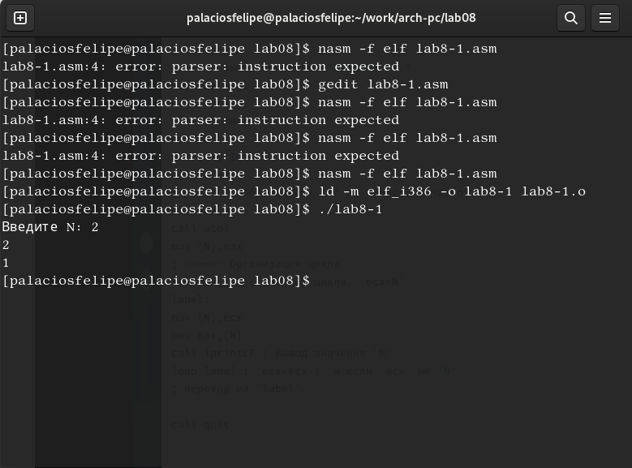
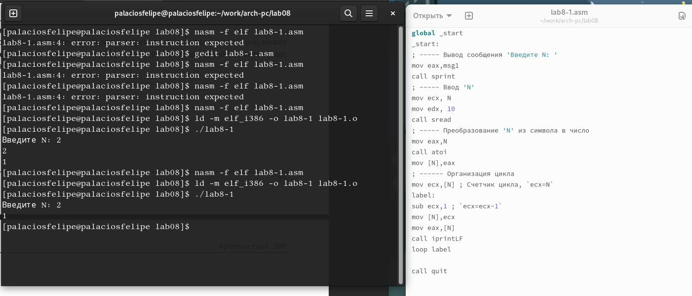
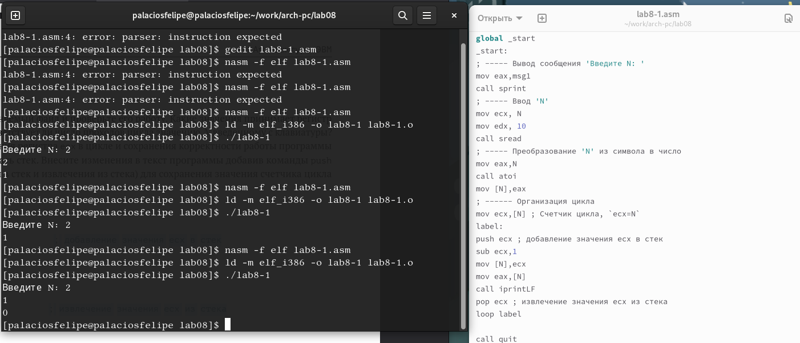
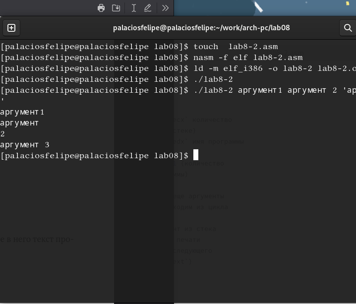
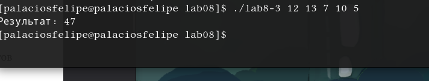
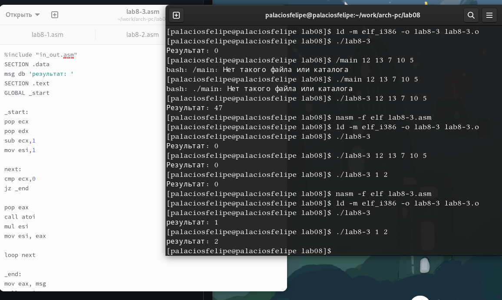

---
## Front matter
title: "ПОтчет по лабораторной работе №8"
subtitle: "Программирование цикла. Обработка аргументов командной строки"
author: "Паласиос Фелипе"

## Generic otions
lang: ru-RU
toc-title: "Содержание"

## Bibliography
bibliography: bib/cite.bib
csl: pandoc/csl/gost-r-7-0-5-2008-numeric.csl

## Pdf output format
toc: true # Table of contents
toc-depth: 2
lof: true # List of figures
lot: true # List of tables
fontsize: 12pt
linestretch: 1.5
papersize: a4
documentclass: scrreprt
## I18n polyglossia
polyglossia-lang:
  name: russian
  options:
	- spelling=modern
	- babelshorthands=true
polyglossia-otherlangs:
  name: english
## I18n babel
babel-lang: russian
babel-otherlangs: english
## Fonts
mainfont: PT Serif
romanfont: PT Serif
sansfont: PT Sans
monofont: PT Mono
mainfontoptions: Ligatures=TeX
romanfontoptions: Ligatures=TeX
sansfontoptions: Ligatures=TeX,Scale=MatchLowercase
monofontoptions: Scale=MatchLowercase,Scale=0.9
## Biblatex
biblatex: true
biblio-style: "gost-numeric"
biblatexoptions:
  - parentracker=true
  - backend=biber
  - hyperref=auto
  - language=auto
  - autolang=other*
  - citestyle=gost-numeric
## Pandoc-crossref LaTeX customization
figureTitle: "Рис."
tableTitle: "Таблица"
listingTitle: "Листинг"
lofTitle: "Список иллюстраций"
lotTitle: "Список таблиц"
lolTitle: "Листинги"
## Misc options
indent: true
header-includes:
  - \usepackage{indentfirst}
  - \usepackage{float} # keep figures where there are in the text
  - \floatplacement{figure}{H} # keep figures where there are in the text
---

# Цель работы

Приобретение навыков написания программ с использованием циклов и обработкой
аргументов командной строки.

# Задание

1. Создайте каталог для программам лабораторной работы No 8, перейдите в него и создайте файл lab8-1.asm:

2. Введите в файл lab8-1.asm текст программы из листинга 8.1. Создайте исполняемый файл и проверьте его работ

3.  Измените текст программы добавив изменение значение регистра ecx в цикле:

label:
sub ecx,1 ; `ecx=ecx-1`
mov [N],ecx
mov eax,[N]
call iprintLF

Создайте исполняемый файл и проверьте его работу. 

4. Для использования регистра ecx в цикле и сохранения корректности работы программы можно использовать стек. Внесите изменения в текст программы добавив команды push и pop (добавления в стек и извлечения из стека) для сохранения значения счетчика цикла
loop:
Создайте исполняемый файл и проверьте его работу. Соответствует ли в данном случае число проходов цикла значению 𝑁 введенному с клавиатуры?

5. Обработка аргументов командной строки
Создайте файл lab8-2.asm в каталоге ~/work/arch-pc/lab08 и введите в него текст программы из листинга 8.2.
Создайте исполняемый файл и запустите его, указав аргументы:Сколько аргументов было обработано программой?

6. Пример программы, которая выводит сумму чисел, которые пере-
даются в программу как аргументы. 
Создайте файл lab8-3.asm в каталоге ~/work/arch-pc/lab08 и введите в него текст программы из листинга 8.3.
Создайте исполняемый файл и запустите его, указав аргументы. 

7. Измените текст программы из листинга 8.3 для вычисления произведения аргументов командной строки

8. Напишите программу, которая находит сумму значений функции 𝑓(𝑥) для
𝑥 = 𝑥1, 𝑥2, ..., 𝑥𝑛, т.е. программа должна выводить значение 𝑓(𝑥1) + 𝑓(𝑥2) + ... + 𝑓(𝑥𝑛).Значения 𝑥𝑖 передаются как аргументы. 

# Выполнение лабораторной работы

1. Создайте каталог для программам лабораторной работы No 8, перейдите в него и создайте файл lab8-1.asm: 

2. Введите в файл lab8-1.asm текст программы из листинга 8.1. Создайте исполняемый файл и проверьте его работ (рис. @fig:001).

{#fig:001 width=70%}

3. Измените текст программы добавив изменение значение регистра ecx в цикле:

label:
sub ecx,1 ; `ecx=ecx-1`
mov [N],ecx
mov eax,[N]
call iprintLF

Создайте исполняемый файл и проверьте его работу (рис. @fig:002).

{#fig:002 width=70%}

4. Для использования регистра ecx в цикле и сохранения корректности работы программы можно использовать стек. Внесите изменения в текст программы добавив команды push и pop (добавления в стек и извлечения из стека) для сохранения значения счетчика цикла
loop:
Создайте исполняемый файл и проверьте его работу. Соответствует ли в данном случае число проходов цикла значению 𝑁 введенному с клавиатуры? (рис. @fig:003).

{#fig:003 width=70%}

5. Обработка аргументов командной строки Создайте файл lab8-2.asm в каталоге ~/work/arch-pc/lab08 и введите в него текст программы из листинга 8.2.
Создайте исполняемый файл и запустите его, указав аргументы:Сколько аргументов было обработано программой? (рис. @fig:004).

{#fig:004 width=70%}

6. Пример программы, которая выводит сумму чисел, которые пере-
даются в программу как аргументы. 
Создайте файл lab8-3.asm в каталоге ~/work/arch-pc/lab08 и введите в него текст программы из листинга 8.3.
Создайте исполняемый файл и запустите его, указав аргументы (рис. @fig:005).

{#fig:005 width=70%}

7. Измените текст программы из листинга 8.3 для вычисления произведения аргументов командной строки (рис. @fig:006).

{#fig:006 width=70%}

8. Напишите программу, которая находит сумму значений функции 𝑓(𝑥) для
𝑥 = 𝑥1, 𝑥2, ..., 𝑥𝑛, т.е. программа должна выводить значение 𝑓(𝑥1) + 𝑓(𝑥2) + ... + 𝑓(𝑥𝑛).Значения 𝑥𝑖 передаются как аргументы (рис. @fig:007).

{#fig:007 width=70%}

# Выводы

Приобретены навыки написания программ с использованием циклов и обработкой
аргументов командной строки.

# Список литературы{.unnumbered}

::: {#refs}
:::
