---
## Front matter
title: "Отчет по лабораторной работе №9"
subtitle: "Понятие подпрограммы. Отладчик GDB."
author: "Паласиос Фелипе"

## Generic otions
lang: ru-RU
toc-title: "Содержание"

## Bibliography
bibliography: bib/cite.bib
csl: pandoc/csl/gost-r-7-0-5-2008-numeric.csl

## Pdf output format
toc: true # Table of contents
toc-depth: 2
lof: true # List of figures
lot: true # List of tables
fontsize: 12pt
linestretch: 1.5
papersize: a4
documentclass: scrreprt
## I18n polyglossia
polyglossia-lang:
  name: russian
  options:
	- spelling=modern
	- babelshorthands=true
polyglossia-otherlangs:
  name: english
## I18n babel
babel-lang: russian
babel-otherlangs: english
## Fonts
mainfont: PT Serif
romanfont: PT Serif
sansfont: PT Sans
monofont: PT Mono
mainfontoptions: Ligatures=TeX
romanfontoptions: Ligatures=TeX
sansfontoptions: Ligatures=TeX,Scale=MatchLowercase
monofontoptions: Scale=MatchLowercase,Scale=0.9
## Biblatex
biblatex: true
biblio-style: "gost-numeric"
biblatexoptions:
  - parentracker=true
  - backend=biber
  - hyperref=auto
  - language=auto
  - autolang=other*
  - citestyle=gost-numeric
## Pandoc-crossref LaTeX customization
figureTitle: "Рис."
tableTitle: "Таблица"
listingTitle: "Листинг"
lofTitle: "Список иллюстраций"
lotTitle: "Список таблиц"
lolTitle: "Листинги"
## Misc options
indent: true
header-includes:
  - \usepackage{indentfirst}
  - \usepackage{float} # keep figures where there are in the text
  - \floatplacement{figure}{H} # keep figures where there are in the text
---

# Цель работы

Приобретение навыков написания программ с использованием подпрограмм. Знакомствос методами отладки  при помощи GDB и его основными возможностями.

# Задание

1. Создайте каталог для выполнения лабораторной работы No 9, перейдите в него и сздайте файл lab09-1.asm

2. 1.Введите в файл lab09-1.asm текст программы из листинга 9.1. Создайте исполняемый файл и проверьте его работу.

  2.Замените текст программы, добавив подпрограмму _subcalcul в подпрограмму _calcul,для вычисления выражения 𝑓(𝑔(𝑥)), где 𝑥 вводится с клавиатуры, 𝑓(𝑥) = 2𝑥 + 7, 𝑔(𝑥) = 3𝑥 − 1. 

3. Создайте файл lab09-2.asm с текстом программы из Листинга 9.2. (Программа печати сообщения Hello world!). 
1.Проверьте работу программы, запустив ее в оболочке GDB с помощью команды run (сокращённо r)
2.для более подробного анализа программы установите брейкпоинт на метку _start, с которой начинается выполнение любой ассемблерной программы, и запустите её.

3.Посмотрите дисассимилированный код программы с помощью команды disassemble
начиная с метки _start

4.Переключитесь на отображение команд с Intel’овским синтаксисом, введя команду set disassembly-flavor intel

5.Включите режим псевдографики для более удобного анализа программы 

4. Работа с данными программы в GDB

1.Посмотреть содержимое регистров также можно с помощью команды info registers
(или i r) 

2.Посмотрите значение переменной msg1 по имени
(gdb) x/1sb &msg1
0x804a000 <msg1>: "Hello, "

3.Посмотрите дисассимилированный код программы с помощью команды disassemble
начиная с метки _start 

4.С помощью команды set измените значение регистра ebx 

5. Скопируйте файл lab8-2.asm, созданный при выполнении лабораторной работы No8, с программой выводящей на экран аргументы командной строки (Листинг 8.2) в файл с именем lab09-3.asm. Создайте исполняемый файл. Для загрузки в gdb программы с аргументами необходимо использовать ключ --args.
Загрузите исполняемый файл в отладчик, указав аргументы

1.Исследуем расположение аргументов командной
строки в стеке после запуска программы с помощью gdb.
Для начала установим точку останова перед первой инструкцией в программе и запустим ее.
(gdb) b _start
(gdb) run

2.Адрес вершины стека храниться в регистре esp и по этому адресу располагается число равное количеству аргументов командной строки (включая имя программы) 
Посмотрите остальные позиции стека – по адесу [esp+4] располагается адрес в памяти где находиться имя программы, по адесу [esp+8] храниться адрес первого аргумента, поаресу [esp+12] – второго и т.д 

6. Задание для самостоятельной работы

1.Преобразуйте программу из лабораторной работы No8 (Задание No1 для самостоятельной работы), реализовав вычисление значения функции 𝑓(𝑥) как подпрограмму 

2.В листинге 9.3 приведена программа вычисления выражения (3 + 2) ∗ 4 + 5. При запуске данная программа дает неверный результат. Проверьте это. С помощью отладчика GDB, анализируя изменения значений регистров, определите ошибку и исправьте ее.

# Выполнение лабораторной работы

1. Создайте каталог для выполнения лабораторной работы No 9, перейдите в него и сздайте файл lab09-1.asm  (рис. @fig:001).

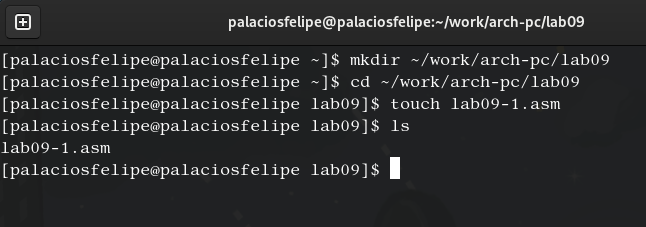{#fig:001 width=70%}

2. 1.Введите в файл lab09-1.asm текст программы из листинга 9.1. Создайте исполняемый файл и проверьте его работу (рис. @fig:002).

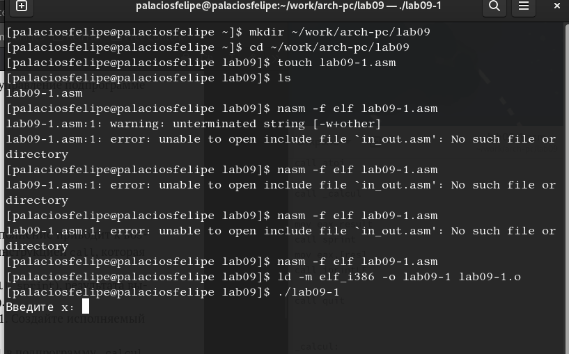{#fig:002 width=70%}

    2.Измените текст программы, добавив подпрограмму _subcalcul в подпрограмму _calcul,для вычисления выражения 𝑓(𝑔(𝑥)), где 𝑥 вводится с клавиатуры, 𝑓(𝑥) = 2𝑥 + 7, 𝑔(𝑥) = 3𝑥 − 1 (рис. @fig:003).

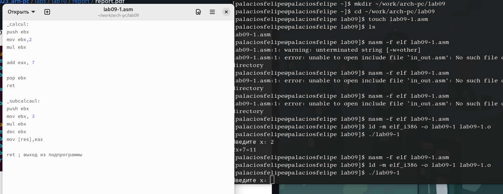{#fig:003 width=70%}

3. Создайте файл lab09-2.asm с текстом программы из Листинга 9.2. (Программа печати сообщения Hello world!) (рис. @fig:004).

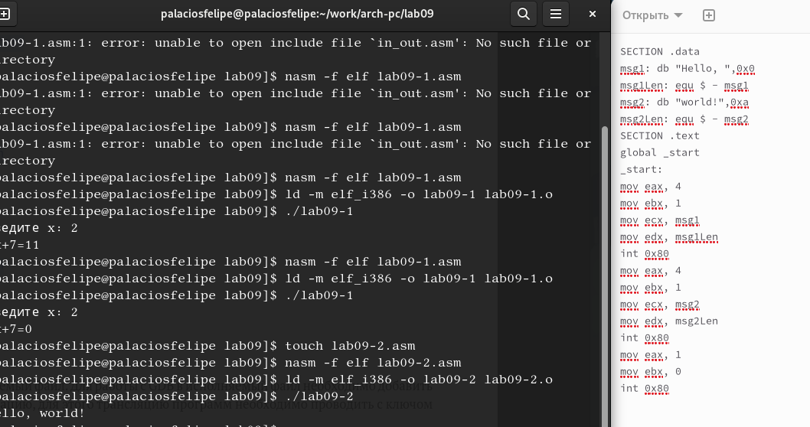{#fig:004 width=70%}

1.Проверьте работу программы, запустив ее в оболочке GDB с помощью команды run (сокращённо r) (рис. @fig:005).

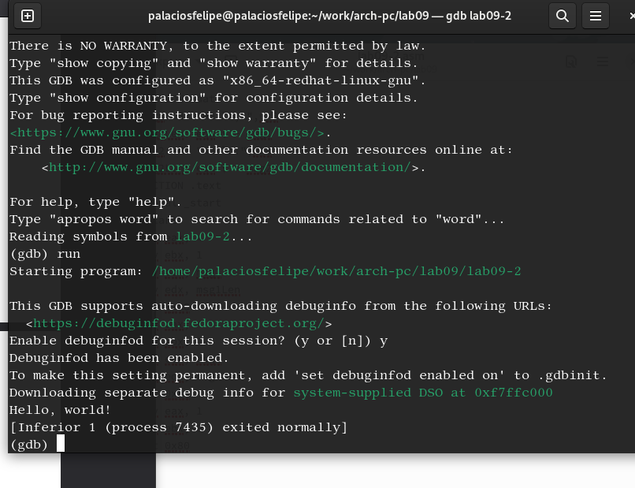{#fig:005 width=70%}

2.для более подробного анализа программы установите брейкпоинт на метку _start, с которой начинается выполнение любой ассемблерной программы, и запустите её  (рис. @fig:006).

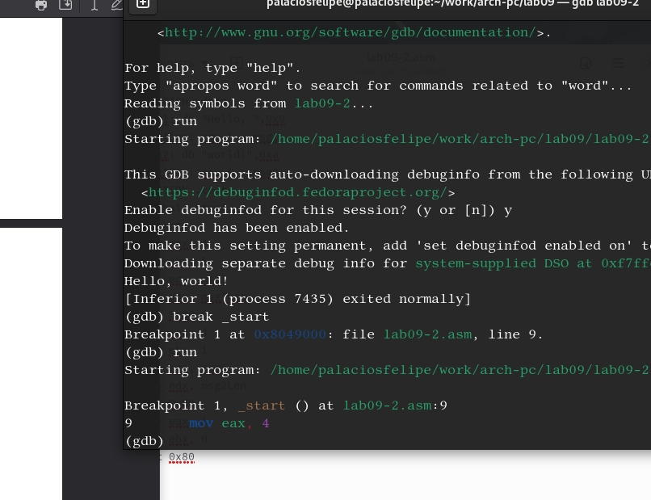{#fig:006 width=70%}

3.Посмотрите дисассимилированный код программы с помощью команды disassemble
начиная с метки _start  (рис. @fig:007).

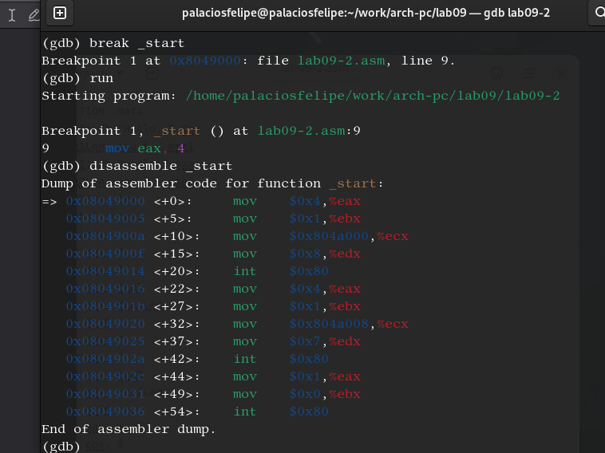{#fig:007 width=70%}

4.Переключитесь на отображение команд с Intel’овским синтаксисом, введя команду set disassembly-flavor intel  (рис. @fig:008).

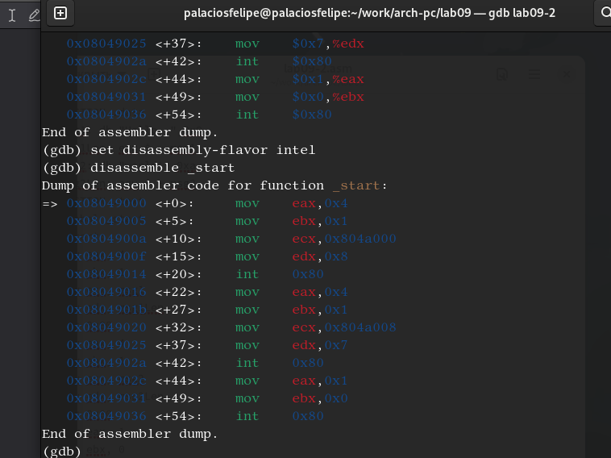{#fig:008 width=70%}

5.Включите режим псевдографики для более удобного анализа программы  (рис. @fig:009).

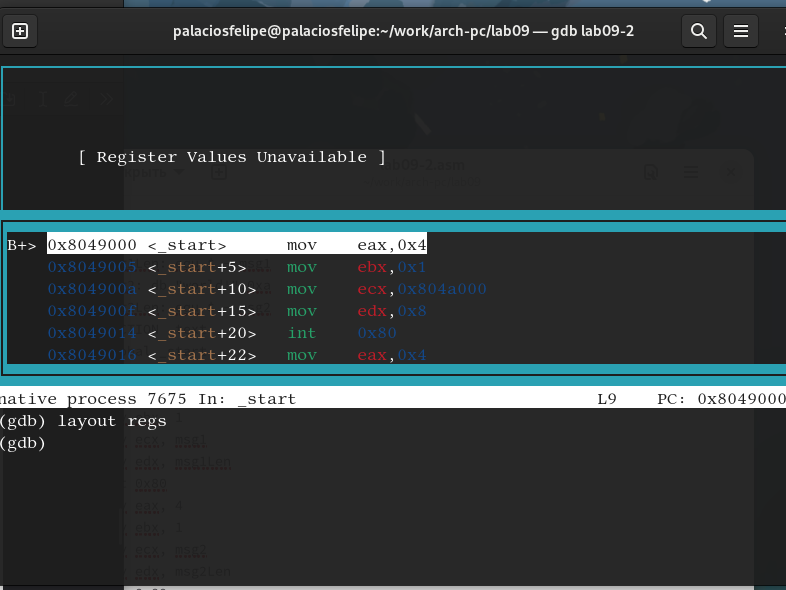{#fig:009 width=70%}

4. Работа с данными программы в GDB

1.Посмотреть содержимое регистров также можно с помощью команды info registers
(или i r) (рис. @fig:010).

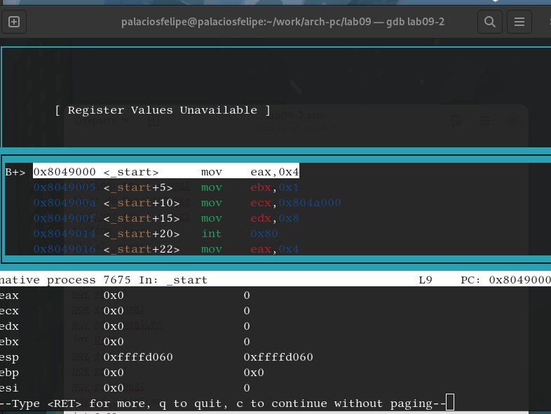{#fig:010 width=70%}

2.Посмотрите значение переменной msg1 по имени
(gdb) x/1sb &msg1
0x804a000 <msg1>: "Hello, " (рис. @fig:011).

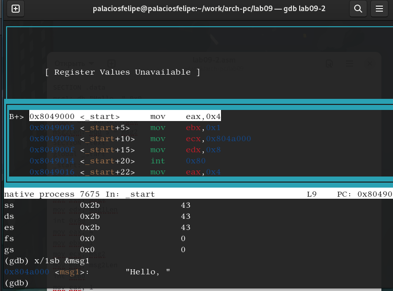{#fig:011 width=70%}

3.Измените первый символ переменной msg1 (рис. @fig:012).

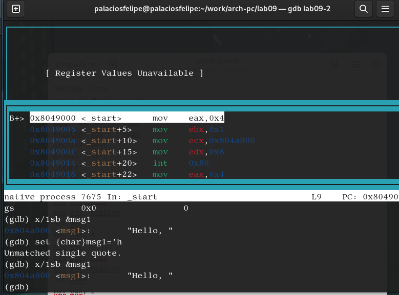{#fig:012 width=70%}

4.С помощью команды set измените значение регистра ebx (рис. @fig:013).

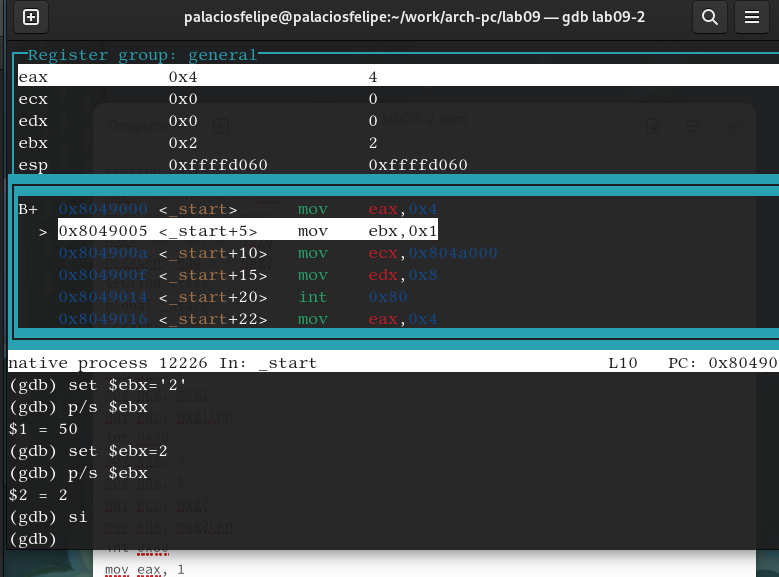{#fig:013 width=70%}

5.Завершите выполнение программы с помощью команды continue (сокращенно c) или
stepi (сокращенно si) и выйдите из GDB с помощью команды quit (сокращенно q). (рис. @fig:014).

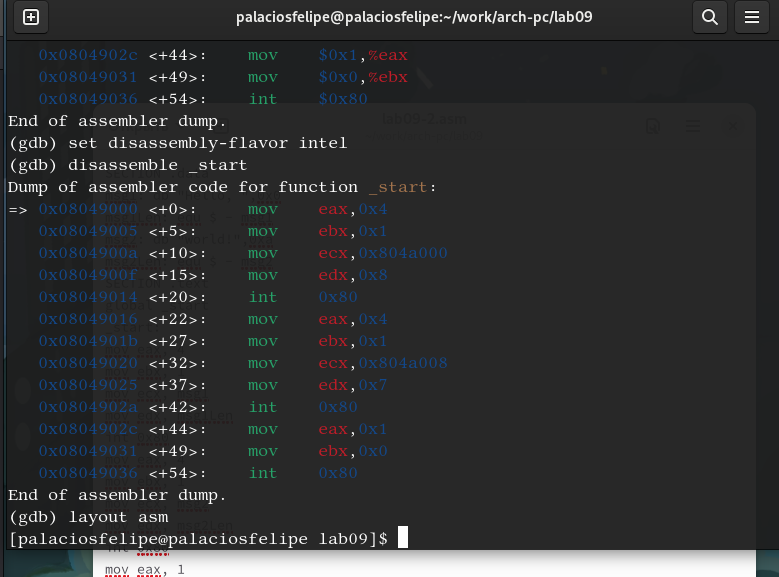{#fig:014 width=70%}

5. Скопируйте файл lab8-2.asm, созданный при выполнении лабораторной работы No8, с программой выводящей на экран аргументы командной строки (Листинг 8.2) в файл с именем lab09-3.asm. Создайте исполняемый файл. Для загрузки в gdb программы с аргументами необходимо использовать ключ --args.
Загрузите исполняемый файл в отладчик, указав аргументы (рис. @fig:015).

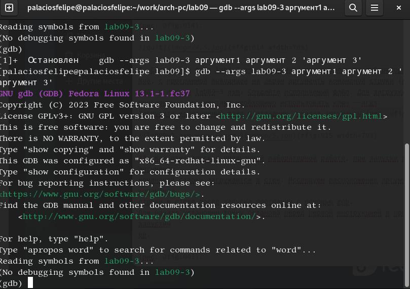{#fig:015 width=70%}

1.Исследуем расположение аргументов командной строки в стеке после запуска программы с помощью gdb.Для начала установим точку останова перед первой инструкцией в программе и запустим ее (gdb) b _start (gdb) run (рис. @fig:016).

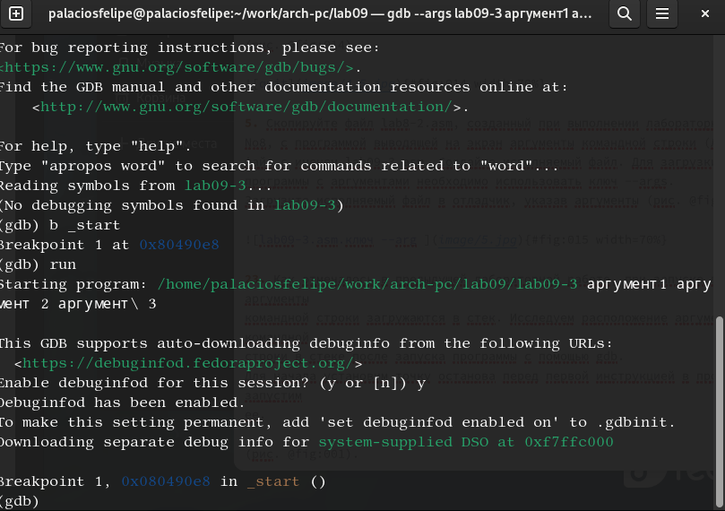{#fig:016 width=70%}

2.Адрес вершины стека храниться в регистре esp и по этому адресу располагается число равное количеству аргументов командной строки (включая имя программы) 
Посмотрите остальные позиции стека – по адесу [esp+4] располагается адрес в памяти где находиться имя программы, по адесу [esp+8] храниться адрес первого аргумента, поаресу [esp+12] – второго и т.д  (рис. @fig:017).

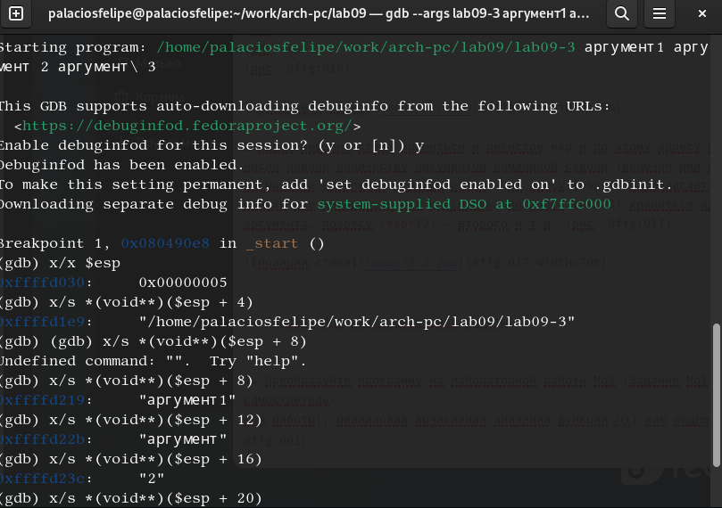{#fig:017 width=70%}

6. Задание для самостоятельной работы

1.Преобразуйте программу из лабораторной работы No8 (Задание No1 для самостоятельной работы), реализовав вычисление значения функции 𝑓(𝑥) как подпрограмму (рис. @fig:018).

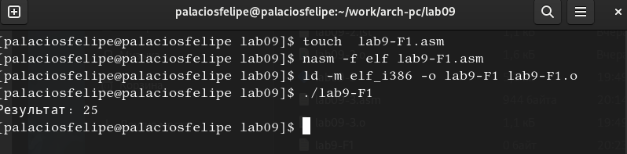{#fig:018 width=70%}

2.В листинге 9.3 приведена программа вычисления выражения (3 + 2) ∗ 4 + 5. При запуске данная программа дает неверный результат. Проверьте это. С помощью отладчика GDB, анализируя изменения значений регистров, определите ошибку и исправьте ее (рис. @fig:019).

{#fig:019 width=70%}

# Выводы

Приобретены навыки написания программ с использованием подпрограмм. Ознакомлен с методами отладки  при помощи GDB и его основными возможностями.

# Список литературы{.unnumbered}

::: {#refs}
:::
